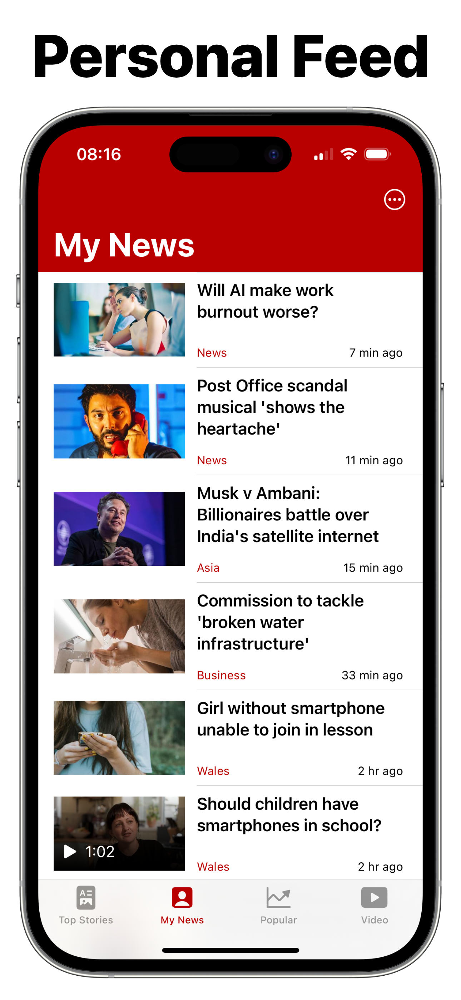

<p align="center">
  
  <br>
  A better client for BBC News.
</p>

# ReadBeeb


A better BBC News client for iOS.

This project is for educational and research purposes only.

## Features

<p align="center">
  
  
  
  
  
</p>

- Dedicated videos tab
- Supports all BBC News international services: English, Cymru, Arabic, Hindi, Mundo and Russian
- Localised news results (English service only)
- Support for low data mode
- Dark mode
- No analytics or tracking
- No account or authentication required
- Personalised news feed displayed in reverse-chronological order
- Rewrite webpage articles to native in-app pages (beta)

## Development

This repository contains the ReadBeeb-specific logic and GUI code.
Logic related to the BBC News API should be contributed to [bbc-news-swift](https://github.com/bilaalrashid/bbc-news-swift).

Prerequisites:
- [SwiftLint](https://github.com/realm/SwiftLint)
- [Swift Package Manager](https://www.swift.org/documentation/package-manager/)

To get started:
```
brew install swiftlint
git clone https://github.com/bilaalrashid/ReadBeeb.git
open ReadBeeb/ReadBeeb.xcodeproj
```

Full contributing guidelines can be found in [CONTRIBUTING.md](CONTRIBUTING.md).

## Tools

To update the list of installed topics:
```
make topics API_KEY=<BBC News OAuth2 Token>
```

## Release

On the `main` branch:
1. Bump the version and build number, tag the project and push:
```
make release VERSION=<version> PUSH=<true|false>
make release BUMP=<major|minor|patch> PUSH=<true|false>
```
2. Create a corresponding [release](https://github.com/bilaalrashid/ReadBeeb/releases/new) on GitHub
